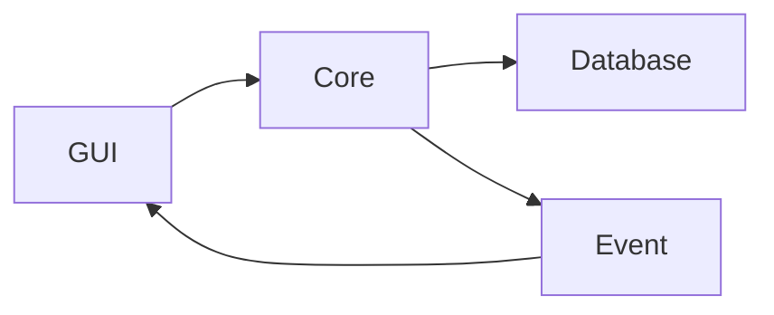

# CryptoSafe Manager

Менеджер паролей с локальным шифрованием  
Проект реализуется поэтапно в рамках 8 спринтов.

## Текущий статус

- Завершён **Sprint 1** — фундамент, структура, placeholder-шифрование, база данных, события, базовый GUI
- В процессе **Sprint 2** — аутентификация, Argon2 + PBKDF2, безопасное управление ключами

## Установка и запуск

### Требования
- Python 3.10+
- Git

### Шаги
1. Склонируйте репозиторий:
  ```bash
    git clone https://github.com/Ansa1r/Crypto.git
    cd Crypto
    python -m venv venv
  ```
2. Создайте виртуальное окружение и активируйте его:
  ```bash
    venv\Scripts\activate
  ```
3.Установите зависимости:
  ```bash
    pip install -r requirements.txt
  ```
4. Запустите приложение:
  ```bash
    python src/gui/main_window.py
  ```

## Roadmap 

- Sprint 1 — Фундамент: структура, placeholder-шифрование (XOR), база данных, события, базовый GUI
→ Завершён
- Sprint 2 — Аутентификация: Argon2 + PBKDF2, безопасное кэширование ключей, смена пароля
→ В работе
- Sprint 3 — Настоящее шифрование: AES-256-GCM, защита от подмены данных
- Sprint 4 — Копирование в буфер обмена с таймером автоочистки
- Sprint 5 — Журнал аудита + подпись событий
- Sprint 6 — Экспорт/импорт, безопасное шеринг записей
- Sprint 7 — Автоблокировка по неактивности, защита от скриншотов (по возможности)
- Sprint 8 — Бэкапы, упаковка в .exe, Docker (опционально)


