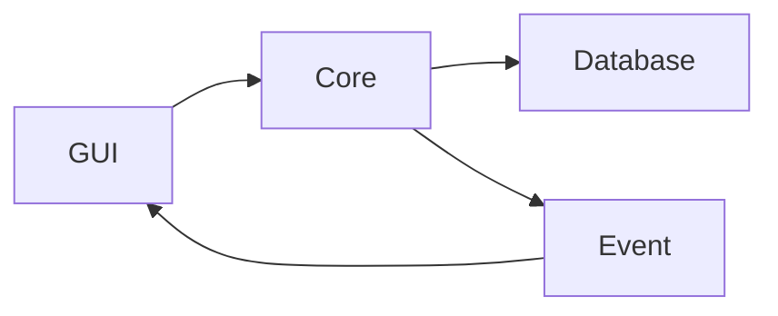

# CryptoSafe Manager

Менеджер паролей с локальным шифрованием  
Проект реализуется поэтапно в рамках 8 спринтов.

## Текущий статус

- Завершён **Sprint 1** — фундамент, структура, placeholder-шифрование, база данных, события, базовый GUI
- В процессе **Sprint 2** — аутентификация, Argon2 + PBKDF2, безопасное управление ключами

## Установка и запуск

### Ключевые технологии
- **Python 3.9+** — основной язык разработки
- **PyQt6** — графический интерфейс
- **SQLite** — локальное хранилище данных
- **Cryptography** — AES-256-GCM шифрование
- **Argon2/PBKDF2** — безопасное хеширование паролей
- **pytest** — тестирование и покрытие кода

## Roadmap проекта (8 спринтов)

### **Sprint 1: Foundation** ✅ (Завершен)
**Цель:** Создание модульной архитектуры и фундаментальных компонентов

**Ключевые результаты:**
- ✅ Модульная структура (core, database, gui, tests)
- ✅ Схема SQLite с таблицами для всех будущих спринтов
- ✅ Placeholder-шифрование (XOR) для демонстрации
- ✅ GUI оболочка с меню и заглушками
- ✅ Event system для слабой связанности компонентов
- ✅ StateManager для отслеживания состояния
- ✅ Тестовая инфраструктура с pytest
- ✅ Config manager для настроек

**Технологии:** SQLite, PyQt6 (заглушки), pytest

---

### **Sprint 2: Master Password & Key Management** 🔒
**Цель:** Реализация безопасной аутентификации и управления ключами

**Ключевые требования:**
- [ ] Argon2id для хеширования мастер-пароля (time_cost=3, memory_cost=64MB)
- [ ] PBKDF2-HMAC-SHA256 для вывода ключа шифрования
- [ ] Два отдельных ключа (аутентификация и шифрование)
- [ ] Проверка сложности пароля (мин. 12 символов, разные классы)
- [ ] Экспоненциальная задержка при неудачных попытках входа
- [ ] Смена мастер-пароля с перешифровкой всех записей
- [ ] Интеграция с OS keychain (опционально)

**Технологии:** argon2-cffi, cryptography, keyring

---

### **Sprint 3: Vault CRUD & AES-256-GCM** 🔐
**Цель:** Полноценное шифрование записей и управление хранилищем

**Ключевые требования:**
- [ ] Замена placeholder на реальный AES-256-GCM
- [ ] Уникальный 12-байтный nonce для каждой записи
- [ ] Формат хранения: `nonce (12B) || ciphertext || tag (16B)`
- [ ] EntryManager для всех CRUD операций
- [ ] Генератор безопасных паролей (secrets.choice)
- [ ] Полноценная таблица с сортировкой и поиском
- [ ] Диалог добавления/редактирования с проверками
- [ ] Поиск с фильтрацией по полям

**Технологии:** cryptography (AESGCM), secrets, PyQt6 (полноценно)

---

### **Sprint 4: Secure Clipboard** 📋
**Цель:** Безопасная работа с буфером обмена и защита от перехвата

**Ключевые требования:**
- [ ] Копирование паролей с автоочисткой (таймер 5-300 сек)
- [ ] Платформозависимые адаптеры (Windows/macOS/Linux)
- [ ] Мониторинг доступа к буферу обмена
- [ ] Уведомления о копировании и очистке
- [ ] Статус-бар с индикацией времени до очистки
- [ ] Защита памяти (mlock/VirtualLock)
- [ ] Настройки безопасности буфера обмена

**Технологии:** pyperclip, win32clipboard, pyobjc, threading

---

### **Sprint 5: Audit Logging** 📊
**Цель:** Криптографически защищенный журнал аудита

**Ключевые требования:**
- [ ] Hash chain для защиты от модификации логов
- [ ] Ed25519/HMAC-SHA256 подписи каждой записи
- [ ] События: аутентификация, операции с записями, clipboard
- [ ] Верификация целостности при запуске
- [ ] Просмотрщик логов с фильтрацией
- [ ] Экспорт в JSON/CSV с подписями
- [ ] Интеграция со всеми компонентами

**Технологии:** cryptography (ed25519), hashlib, json

---

### **Sprint 6: Import/Export & Sharing** 🔄
**Цель:** Обмен данными и резервное копирование

**Ключевые требования:**
- [ ] Экспорт в зашифрованный JSON (AES-256-GCM)
- [ ] Импорт из Bitwarden/LastPass форматов
- [ ] Шифрование паролем или публичным ключом
- [ ] QR-коды для обмена ключами и записями
- [ ] Разделение прав (read-only/edit)
- [ ] Валидация и санитизация импортируемых данных
- [ ] Совместимость со стандартными форматами

**Технологии:** qrcode, cryptography (RSA/ECC), base64, zlib

---

### **Sprint 7: Security Hardening** 🛡️
**Цель:** Защита от side-channel атак и удобство использования

**Ключевые требования:**
- [ ] Constant-time операции (пароли, криптография)
- [ ] Secure memory allocator с блокировкой страниц
- [ ] Автоблокировка по неактивности (1-480 мин)
- [ ] Системный трей с быстрым доступом
- [ ] Panic mode (экстренная блокировка по хоткею)
- [ ] Профили безопасности (Standard/Enhanced/Paranoid)
- [ ] Защита от дампов памяти

**Технологии:** ctypes, platform-specific API, threading

---

### **Sprint 8: Final Integration & Packaging** 📦
**Цель:** Сборка, документация и презентация проекта

**Ключевые требования:**
- [ ] Интеграция всех модулей без циклических зависимостей
- [ ] Полное тестирование (≥80% coverage)
- [ ] Сборка в единый executable (PyInstaller)
- [ ] Документация (README, user guide, technical summary)
- [ ] Демо-видео (3-4 минуты)
- [ ] Финальная презентация (5 минут)
- [ ] Решение всех критических багов

**Технологии:** PyInstaller, pytest-cov, Markdown

# Установка и запуск

### Требования
- Python 3.9 или выше
- pip (менеджер пакетов)
- Виртуальное окружение (рекомендуется)

### Клонирование репозитория
  ```
    git clone https://github.com/Ansa1r/Crypto.git
    cd Crypto
  ```

### Создание виртуального окружения
  ```
    python -m venv venv
  ```

### Активация (Windows)
  ```
    venv\Scripts\activate
  ```

### Активация (Linux/macOS)
  ```
    source venv/bin/activate
  ```

### Установка зависимостей
  ```
    pip install -r requirements.txt
  ```

### Запуск приложения
  ```
    python src/gui/main_window.py
  ```

# Структура программы

