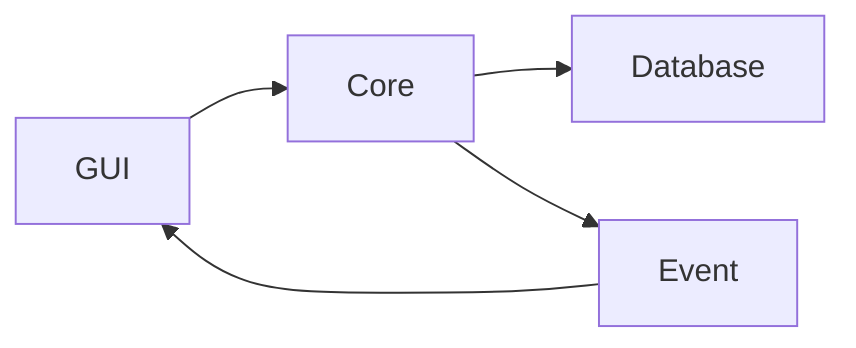

# CryptoSafe Manager

Менеджер паролей с локальным шифрованием  
Проект реализуется поэтапно в рамках 8 спринтов.

## Текущий статус

- Завершён **Sprint 1** — фундамент, структура, placeholder-шифрование, база данных, события, базовый GUI
- В процессе **Sprint 2** — аутентификация, Argon2 + PBKDF2, безопасное управление ключами

## Установка и запуск

### Требования
- Python 3.10+
- Git

### Шаги
1. Склонируйте репозиторий:
  ```bash
    git clone https://github.com/Ansa1r/Crypto.git
    cd Crypto
    python -m venv venv
  ```
2. Создайте виртуальное окружение и активируйте его:
  ```bash
    venv\Scripts\activate
  ```
3.Установите зависимости:
  ```bash
    pip install -r requirements.txt
  ```
4. Запустите приложение:
  ```bash
    python src/gui/main_window.py
  ```

## Roadmap 

- Sprint 1 
→ Завершён
- Sprint 2
→ В работе
- Sprint 3 
- Sprint 4 
- Sprint 5 
- Sprint 6 
- Sprint 7 
- Sprint 8 


